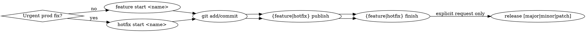

## What is Simple Flow?

Simple Flow is a single-trunk Git branching model with semver versioning built in. Feature branches, hotfixes, PR
workflows, and releases are all managed through composable CLI commands — no release branches, no develop branch, no feature flags.

**Core rules:**

- **One trunk (`main`), no other long-lived branches.** All work starts from `main` and merges back.
- **Releases are tags, not branches.** A release is a semver tag (`v1.2.3`) on `main`. Nothing to maintain after.
- **Hotfixes branch from tags, not `main`.** This guarantees the fix contains only released code plus the change — no
  unreleased feature work leaks in.
- **Semver is built in.** Versions live in git tags. `major`, `minor`, or `patch` bumps are a single command.
- **`main` is latest, tags are stable.** The tip of `main` is a rolling "latest" channel. Tags mark explicitly blessed
  stable points.

**Lifecycle:** branch → commit → PR → merge → tag (when ready).

**When NOT to use Simple Flow:** parallel release lines (v1.x + v2.x), monorepos with independent package versions,
continuous deployment with no version numbers, or orgs that mandate feature flags for every change.

## Overview

git-sf is the CLI that implements Simple Flow. Use it for all branch/PR/release lifecycle ops when available. Fall back
to raw git/gh if not installed.

```sh
which git-sf   # verify presence before using
```

## Workflow



- Branch name from task: "add login page" → `add-login-page`
- `start` creates the branch only; `--draft-pr` is optional.
- `publish` after commits — title auto-derived; override with `--title`/`--body`.
- `finish`/`discard`/`release` have built-in prompts — do NOT double-ask.
- Hotfix: `git sf hotfix finish --release` squashes the branch, tags the squashed commit with the next patch version, force-pushes, then merges via merge commit. The tag lives on the hotfix branch (not on main HEAD). `hotfix_auto_release: true` config does the same.
- Run `git sf release` only on explicit user request. First release creates `v0.1.0` regardless of scope.
- First-time setup: `git sf init [--force]`. Debug: `git sf config`.

Global flags: `--dry-run`, `--verbose`, `--yes` (auto-confirm prompts), `--no-interactive` (disable prompts).

## Command Reference

| Operation                | Command                                                 |
|--------------------------|---------------------------------------------------------|
| New feature branch       | `git sf feature start <name>`                           |
| New feature + draft PR   | `git sf feature start <name> --draft-pr [--title "…"]`  |
| Push branch + open PR    | `git sf feature publish [--title "…"] [--body "…"]`     |
| Merge PR + cleanup       | `git sf feature finish [--force] [--preview [--scope]]` |
| Close PR + cleanup       | `git sf feature discard [--reason "…"]`                 |
| New hotfix branch        | `git sf hotfix start <name> [--draft-pr] [--title "…"]` |
| Push hotfix + open PR    | `git sf hotfix publish [--title "…"] [--body "…"]`      |
| Merge hotfix + cleanup   | `git sf hotfix finish [--force] [--release]`            |
| Close hotfix + cleanup   | `git sf hotfix discard [--reason "…"]`                  |
| Tag semver release       | `git sf release [major\|minor\|patch] [-m "…"]`         |
| Tag preview release      | `git sf release preview [--scope major\|minor\|patch]`  |
| Show branch/PR status    | `git sf status`                                         |
| First-time setup / debug | `git sf init [--force]`, `git sf config`                |

## Error Handling

| Error                   | Action                                       |
|-------------------------|----------------------------------------------|
| Dirty working tree      | Commit or `git stash` first                  |
| No PR on finish         | `git sf {feature\|hotfix} publish` first     |
| PR checks failing       | Inform user; suggest `--force` only if asked |
| No tags on hotfix start | Run `git sf release` first                   |
| gh not installed/authed | Inform user; `gh auth login`                 |
| Wrong branch            | Switch to the correct branch first           |

## Raw Git Only

`git add`, `git commit`, `git diff`, `git log`, `git stash`, `git status`, `git rebase`, `git cherry-pick` —
non-lifecycle ops.
