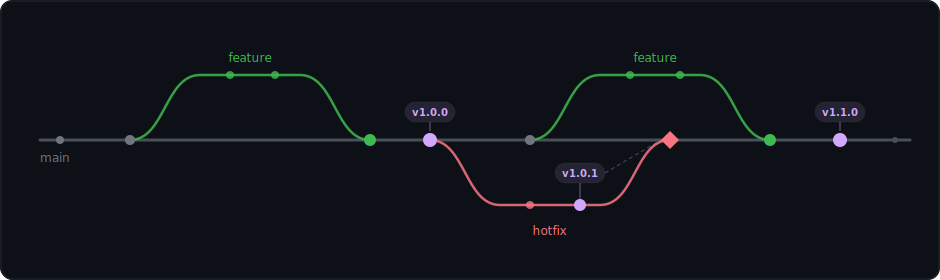
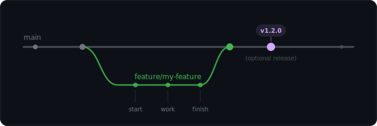
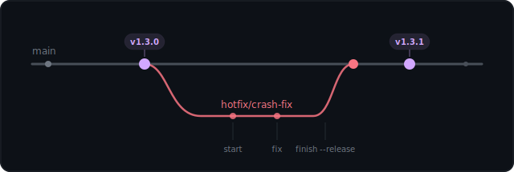
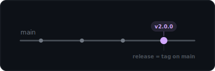
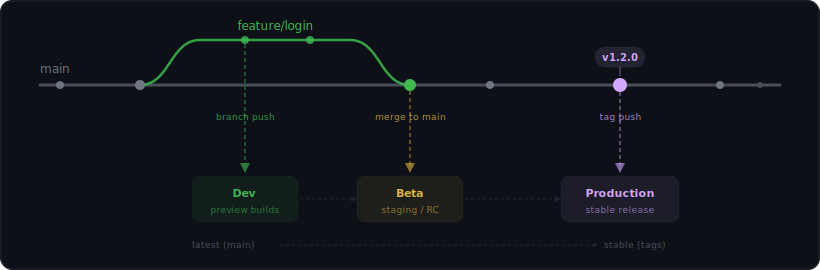

# Simple Flow

[README](../README.md) · [Installation](installation.md)

Simple Flow is a single-trunk Git branching model with semver versioning built in.
You work on feature branches, merge to `main` via PR, and tag releases when you are ready — no release branches, no develop branch, no feature flags.
Hotfixes branch from release tags so production fixes stay clean, and every step from branching to releasing is a single composable command.

**Contents:** [Visual Overview](#visual-overview) · [Core Principles](#core-principles) · [Workflows](#workflows) · [Preview Releases](#preview-release-workflow) · [Configuration](#configuration) · [Comparison](#how-simple-flow-compares) · [Deployment Strategy](#deployment-strategy) · [Edge Cases](#edge-cases) · [When to Use Something Else](#when-to-use-something-else)

## Visual Overview

<p align="center">
  
</p>

All work branches from `main`. Releases are tags on `main`. Hotfixes branch from the latest release tag — the patch tag
is placed on the hotfix branch before merging back to `main`, so it never includes unreleased work. There are no
long-lived branches other than `main`.

## Core Principles

- **One trunk, many branches** — All work starts from `main` and merges back. No develop, staging, or release branches.
- **Tags are releases** — A release is a semver tag on `main`, not a branch. Nothing to maintain after the fact.
- **Versioning is built in** — Every release gets `v<major>.<minor>.<patch>`. The version lives in git tags, not in a
  file you have to bump manually.
- **Hotfixes branch from tags** — Branch from the release tag, fix, squash, tag the branch, and merge back to `main`.
  The release tag lives on the hotfix branch — it contains only released code plus the fix.
- **`main` is latest, tags are stable** — The tip of `main` always contains the newest work — think of it as a rolling
  "latest" channel. Tags mark the points you have explicitly blessed as stable. This separation lets you deploy and test
  from `main` without affecting users on the tagged release.
- **No feature flags required** — Branches can live for days or weeks, so you ship when the feature is ready, not when the deploy
  pipeline demands it.

## Workflows

### Feature Workflow

<p align="center">
  
</p>

1. **Start the branch.** This creates `feature/my-feature` from the tip of `main` and switches to it.

   ```bash
   git sf feature start my-feature
   ```

   > [!TIP]
   > Pass `--draft-pr` (or enable [`draft_pr_on_start`](../README.md#configuration) in config) to push and open a draft PR in one step.

2. **Work and commit as normal.** Nothing special here — use your usual git workflow.

   ```bash
   git add .
   git commit -m "feat: add login form"
   ```

   > [!IMPORTANT]
   > **On branch lifetime:** Feature branches can live for days or weeks. Unlike GitHub Flow, there is no pressure to merge
   > the same day. Unlike Git Flow, there is no develop branch where unreleased work accumulates and becomes hard to reason
   > about. The branch is yours until you are done. When you merge, it goes straight to the trunk.

3. **Publish the branch.** Pushes to origin and opens a pull request against `main`.

   ```bash
   git sf feature publish
   ```

4. **Finish the feature.** Merges the PR (after checks pass), switches back to `main`, and deletes the feature branch
   locally and on the remote.

   ```bash
   git sf feature finish
   ```

5. **Optionally cut a release.** If this feature is worth shipping on its own, tag it. For a full stable release, use
   `git sf release`. To tag a preview release instead (e.g. for beta testing before the final release), pass `--preview`
   to `finish`:

   ```bash
   git sf release minor                       # stable release
   git sf feature finish --preview            # preview release after merging
   git sf feature finish --preview --scope minor  # explicit bump level
   ```

> [!TIP]
> **Changed your mind?** Run `git sf feature discard` to close the PR, delete the branch, and switch back to `main`.
>
> **Check your progress** at any time with `git sf status` to see your branch, PR, and CI state.

### Hotfix Workflow

<p align="center">
  
</p>

1. **Start the hotfix.** This branches from the latest release tag — not from the tip of `main`. The branch contains
   only released code.

   ```bash
   git sf hotfix start crash-fix
   ```

   > [!TIP]
   > Pass `--draft-pr` (or enable [`draft_pr_on_start`](../README.md#configuration) in config) to push and open a draft PR in one step.

2. **Fix and commit.**

   ```bash
   git add .
   git commit -m "fix: prevent nil pointer on empty input"
   ```

3. **Publish the hotfix.** Pushes and opens a PR.

   ```bash
   git sf hotfix publish
   ```

4. **Finish with a release.** Squashes the branch to a single commit, tags it with the next patch version, force-pushes,
   then merges the PR into `main` via a merge commit. The tag lives on the hotfix branch — it contains only released code
   plus the fix. The `--release` flag (or [`hotfix_auto_release`](../README.md#configuration) in config) handles this automatically.

   ```bash
   git sf hotfix finish --release
   ```

   The resulting git graph:

   ```
   (v1.2.3) A --- B --- C --- M (main)     ← merge commit
                   \           /
                    `-- D (v1.2.4)'         ← squashed hotfix commit
   ```

> [!TIP]
> **Changed your mind?** Run `git sf hotfix discard` to close the PR, delete the branch, and switch back to `main`.
>
> **Check your progress** at any time with `git sf status` to see your branch, PR, and CI state.

> [!IMPORTANT]
> **Key point:** The hotfix branches from the *tag*, not from `main`, and the release tag is placed on the hotfix branch
> before merging. This guarantees the tag contains only released code plus the fix — no unreleased feature work leaks in.
> `git log --first-parent main` shows a clean linear history of merge commits.

### Release Workflow

<p align="center">
  
</p>

A release is not a branch. It is a point-in-time snapshot of `main` captured as a git tag.

1. **Tag the release.** Specify the semver bump level: `major`, `minor`, or `patch`. `git sf` verifies that your local
   `main` is in sync with origin, finds the latest tag, increments the appropriate segment, and creates the new tag.

   ```bash
   git sf release minor
   ```

2. **Confirm when prompted.** The tool shows the version bump (e.g., `v1.2.0 -> v1.3.0`) and asks for confirmation.

3. **Tag is pushed to origin.** This triggers whatever CI/CD pipeline you have wired to tag events (GoReleaser, GitHub
   Actions, etc.).

> [!NOTE]
> There are no release branches. If a release needs a fix after the fact, that is a hotfix — branch from the
> tag, fix it, and cut a patch release.

### Preview Release Workflow

A preview release is a semver pre-release tag (e.g. `v1.3.0-beta.1`) used to signal that the next version is
available for early testing without committing to a stable release. Preview tags follow the same versioning rules as
stable releases — the bump level controls which segment increments — but they include a configurable suffix
(`beta`, `rc`, `alpha`, etc.).

1. **Tag a preview release directly from main:**

   ```bash
   git sf release preview                # uses default_prerelease_bump from config
   git sf release preview --scope patch  # explicit bump level
   git sf release preview -m "message"   # create an annotated tag
   ```

2. **Or trigger a preview tag as part of feature finish:**

   ```bash
   git sf feature finish --preview
   git sf feature finish --preview --scope minor
   ```

   This merges the PR and then immediately creates the preview tag on the resulting `main` commit.

3. **Follow up with a stable release** when you are satisfied the preview is good:

   ```bash
   git sf release minor
   ```

> [!TIP]
> Configure the suffix and default bump in `.sfconfig.yml`:
> ```yaml
> prerelease_enabled: true
> prerelease_suffix: rc
> default_prerelease_bump: minor
> ```

## Configuration

Configuration is merged from three layers, each overriding the previous:

1. **Built-in defaults** — sensible out-of-the-box behavior, no files needed
2. **Global config** — `~/.config/git-sf/config.yml` — your personal defaults across all repos
3. **Repo config** — `.sfconfig.yml` at the repo root — shared team conventions

Run `git sf config` to see the effective values and which layer each one comes from.

### Options

| Key                        | Default    | Description                                                     |
|----------------------------|------------|-----------------------------------------------------------------|
| `main_branch`              | `main`     | The trunk branch name                                           |
| `tag_prefix`               | `v`        | Prefix for release tags (e.g. `v1.2.3`)                         |
| `feature_prefix`           | `feature/` | Prefix for feature branches                                     |
| `hotfix_prefix`            | `hotfix/`  | Prefix for hotfix branches                                      |
| `merge_strategy`           | `squash`   | PR merge strategy: `squash`, `merge`, or `rebase`               |
| `default_release_bump`     | `minor`    | Default semver bump for `release`: `major`, `minor`, or `patch` |
| `draft_pr_on_start`        | `false`    | Auto-create a draft PR when starting a branch                   |
| `hotfix_auto_release`      | `false`    | Auto-tag a patch release after `hotfix finish`                  |
| `prerelease_enabled`       | `false`    | Enable preview release tagging                                  |
| `default_prerelease_bump`  | `patch`    | Default semver bump for preview releases                        |
| `prerelease_suffix`        | `beta`     | Suffix for preview tags (`beta`, `rc`, `alpha`, etc.)           |

### Example: team config

A team that uses merge commits, auto-creates draft PRs, and uses `rc` suffixes for previews:

```yaml
# .sfconfig.yml
main_branch: main
merge_strategy: merge
draft_pr_on_start: true
prerelease_enabled: true
prerelease_suffix: rc
default_prerelease_bump: minor
```

Run `git sf init` to generate a starter `.sfconfig.yml`, or `git sf init --force` to overwrite an existing one.

## How Simple Flow Compares

|                          | Git Flow                                      | GitHub Flow           | Simple Flow                         |
|--------------------------|-----------------------------------------------|-----------------------|-------------------------------------|
| **Trunk branch**         | `develop` + `main`                            | `main`                | `main`                              |
| **Release branches**     | Yes                                           | No                    | No                                  |
| **Feature branches**     | Long-lived                                    | Short-lived           | Flexible                            |
| **Hotfix path**          | Branch from main tag, merge to main + develop | Just a PR             | Branch from tag, merge to main      |
| **Built-in versioning**  | No                                            | No                    | Yes (semver tags)                   |
| **Preview releases**     | Via release branches                          | No                    | Yes (`release preview` / `--preview`) |
| **Feature flags needed** | Rarely                                        | Often                 | No                                  |
| **Ceremony**             | High                                          | Low                   | Low                                 |
| **Best for**             | Scheduled releases, multiple environments     | Continuous deployment | Trunk-based with versioned releases |

## Deployment Strategy

Simple Flow maps naturally to three deployment channels — **dev**, **beta**, and **production** — without extra
branches or infrastructure:

| Trigger                          | Channel                  | What it contains                     | Typical use                              |
|----------------------------------|--------------------------|--------------------------------------|------------------------------------------|
| Push to a feature/hotfix branch  | **Dev**                  | Work in progress, single feature     | Developer testing, preview environments  |
| Merge to `main`                  | **Beta / RC**            | All accepted work since the last tag | Integration testing, internal dogfooding |
| Push a preview tag (`v*.*.*-<suffix>.*`) | **Beta / RC**   | Explicitly tagged preview snapshot   | Early adopters, opt-in beta channel      |
| Push a semver tag (`v*.*.*`)     | **Production / Stable**  | Explicitly blessed snapshot          | End-user release                         |

### How it works

<p align="center">
  
</p>

**Dev builds** are triggered by any push to a feature or hotfix branch. These are throwaway artifacts for the developer
or reviewer — deploy to a preview environment, run on a device, share with QA. They carry no version promise.

**Beta builds** are triggered by an explicit preview tag pushed via `git sf release preview` (or `git sf feature finish
--preview`). Rather than treating every merge to `main` as a beta, Simple Flow lets maintainers deliberately tag a
preview release — e.g. `v1.3.0-beta.1` — when the work on `main` is considered ready for early testing. This gives
beta testers a stable, named snapshot rather than an ever-moving tip.

**Production releases** are triggered when a semver tag is pushed. This is the only thing end users see. Because the tag
points to a specific commit on `main`, you always know exactly what code is in a production build.

> [!TIP]
> Most CI systems (GitHub Actions, GitLab CI, etc.) already distinguish between branch pushes and tag pushes in their
> trigger configuration. Simple Flow takes advantage of that: no extra branches or environment-specific config needed —
> just wire your pipeline to the three triggers above.

### Example: GitHub Actions triggers

Three separate workflow files, one per channel:

<table>
<tr>
<td>

**`.github/workflows/dev.yml`**

```yaml
on:
  push:
    branches:
      - 'feature/**'
      - 'hotfix/**'

jobs:
  dev:
    runs-on: ubuntu-latest
    steps:
      # Build preview artifact
      # Deploy to dev environment
```

</td>
<td>

**`.github/workflows/beta.yml`**

```yaml
on:
  push:
    tags: ['v*.*.*-*']

jobs:
  beta:
    runs-on: ubuntu-latest
    steps:
      # Build beta artifact
      # Deploy to RC channel
```

</td>
<td>

**`.github/workflows/release.yml`**

```yaml
on:
  push:
    tags: ['v*.*.*']

jobs:
  release:
    # Exclude prerelease tags
    if: "!contains(github.ref_name, '-')"
    runs-on: ubuntu-latest
    steps:
      # Build production artifact
      # Publish to registry
```

</td>
</tr>
</table>

### Hotfix fast path

When a hotfix finishes with `--release`, the branch is squashed to a single commit, tagged with the next patch version,
and force-pushed before merging into `main`. The tag push triggers the production release immediately — before the merge
to `main` even happens. This means the hotfix goes from dev → production in seconds, and the subsequent merge to `main`
triggers the beta/RC channel. Your CI handles each stage automatically.

## Edge Cases

### Hotfix while a feature is in progress

Hotfix takes priority. Merge the hotfix first, then rebase your feature branch onto the updated `main`. `git sf` does
not automate this part — use standard git:

```bash
git checkout feature/my-feature
git rebase main
```

### Multiple concurrent feature branches

Feature branches are independent and merge separately. If two branches touch the same files, normal merge conflict
resolution applies during the PR. There is no coordination mechanism beyond what git and your code review process
already provide.

### Two releases cut close together

Tags are sequential on `main`. `git sf` always finds the latest tag and bumps from there. If you tag `v1.4.0` and then
immediately tag again, you get `v1.5.0` (or `v1.4.1`, depending on the bump level). There is no conflict.

### Feature branch falls behind main

Rebase or merge `main` into your feature branch before the PR can be merged. `git sf` does not enforce a strategy — it
only requires the PR to be mergeable. Pick whichever approach your team prefers:

```bash
# Option A: rebase
git checkout feature/my-feature
git rebase main

# Option B: merge
git checkout feature/my-feature
git merge main
```

### Hotfix needs unreleased feature code

This scenario indicates a workflow issue. Hotfixes should always branch from the tag. If the fix genuinely depends on
work that has not been released yet, the right move is to merge that work into `main` first, cut a new release from
`main`, and skip the hotfix workflow entirely.

## When to Use Something Else

1. **Parallel release lines** (maintaining v1.x and v2.x simultaneously) — Simple Flow assumes a single version stream.
   Use Git Flow with release branches, or a custom branching model that supports multiple active release lines.

2. **Monorepo with independent packages** — Simple Flow's single-version model tags the entire repository. If your
   packages version and release independently, you need per-package tooling or a monorepo-aware release system.

3. **Continuous deployment with no versions** — If every merge to `main` goes straight to production and you never need
   to refer to a version number, plain GitHub Flow is simpler. Simple Flow's value is in the versioning; remove that and
   it is just overhead.

4. **Feature flags required by policy** — If your organization mandates feature flags for every change, the branching
   model adds no value over GitHub Flow. The whole point of longer-lived branches in Simple Flow is to avoid flags — if
   you must use flags anyway, take the simpler model.

---

<div align="center">

[README](../README.md) · [Installation](installation.md) · [Contributing](../CONTRIBUTING.md)

</div>
