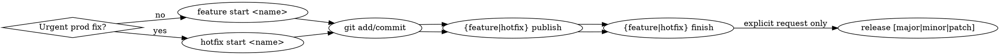

## Overview

git-sf is a trunk-based Git workflow CLI. Use it for all branch/PR/release lifecycle ops when available; fall back to raw git/gh if absent — do NOT auto-install.

```sh
which git-sf   # verify presence before using
```

## Workflow



- Branch name from task: "add login page" → `add-login-page`
- `start` creates the branch only; `--draft-pr` is optional.
- `publish` after commits — title auto-derived; override with `--title`/`--body`.
- `finish`/`discard`/`release` have built-in prompts — do NOT double-ask.
- Hotfix: `git sf hotfix finish --release` auto-tags patch. `hotfix_auto_release: true` config does the same.
- Run `git sf release` only on explicit user request. First release creates `v0.1.0` regardless of scope.
- First-time setup: `git sf init [--force]`. Debug: `git sf config`.

Global flags: `--dry-run`, `--verbose`.

## Command Reference

| Operation | Command |
|---|---|
| New feature branch | `git sf feature start <name>` |
| New feature + draft PR | `git sf feature start <name> --draft-pr [--title "…"]` |
| Push branch + open PR | `git sf feature publish [--title "…"] [--body "…"]` |
| Merge PR + cleanup | `git sf feature finish [--force]` |
| Close PR + cleanup | `git sf feature discard [--reason "…"]` |
| New hotfix branch | `git sf hotfix start <name> [--draft-pr] [--title "…"]` |
| Push hotfix + open PR | `git sf hotfix publish [--title "…"] [--body "…"]` |
| Merge hotfix + cleanup | `git sf hotfix finish [--force] [--release]` |
| Close hotfix + cleanup | `git sf hotfix discard [--reason "…"]` |
| Tag semver release | `git sf release [major\|minor\|patch]` |
| Show branch/PR status | `git sf status` |
| First-time setup / debug | `git sf init [--force]`, `git sf config` |

## Error Handling

| Error | Action |
|---|---|
| Dirty working tree | Commit or `git stash` first |
| No PR on finish | `git sf {feature\|hotfix} publish` first |
| PR checks failing | Inform user; suggest `--force` only if asked |
| No tags on hotfix start | Run `git sf release` first |
| gh not installed/authed | Inform user; `gh auth login` |
| Wrong branch | Switch to the correct branch first |

## Raw Git Only

`git add`, `git commit`, `git diff`, `git log`, `git stash`, `git status`, `git rebase`, `git cherry-pick` — non-lifecycle ops.
